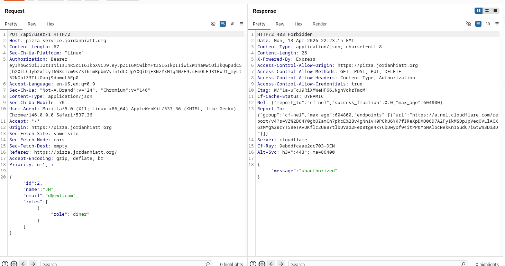
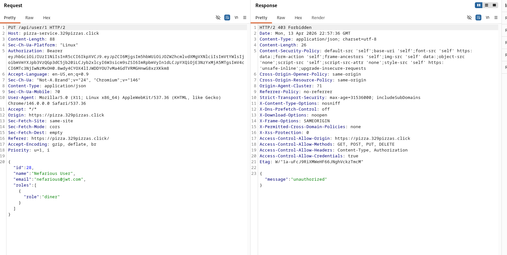
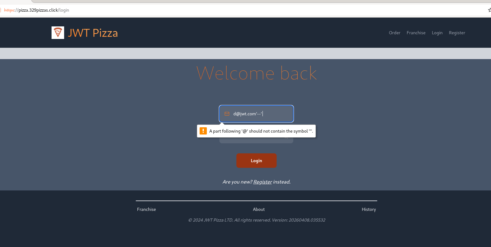
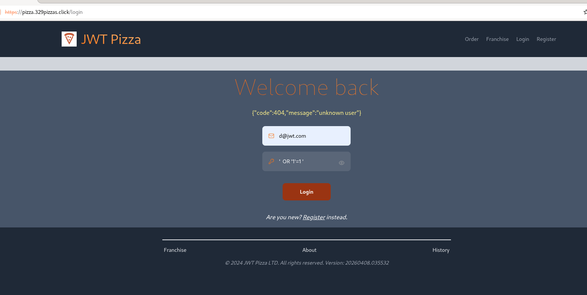
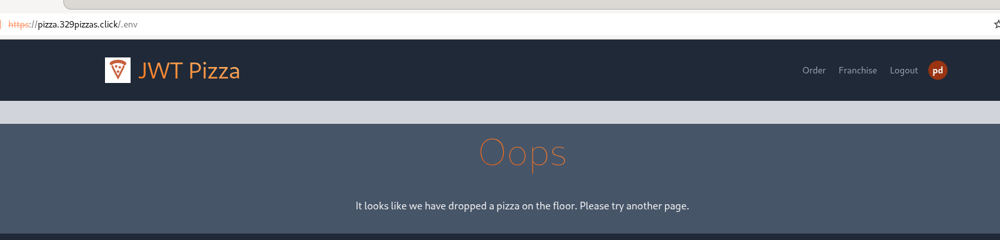
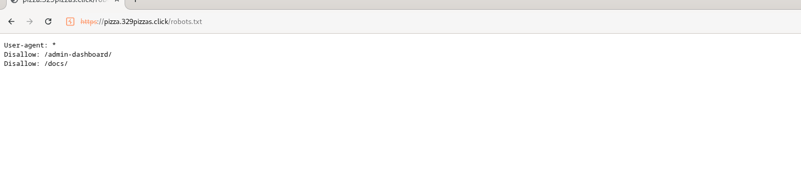
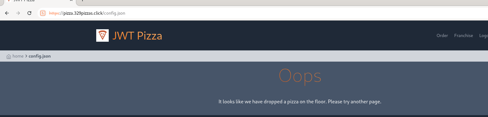
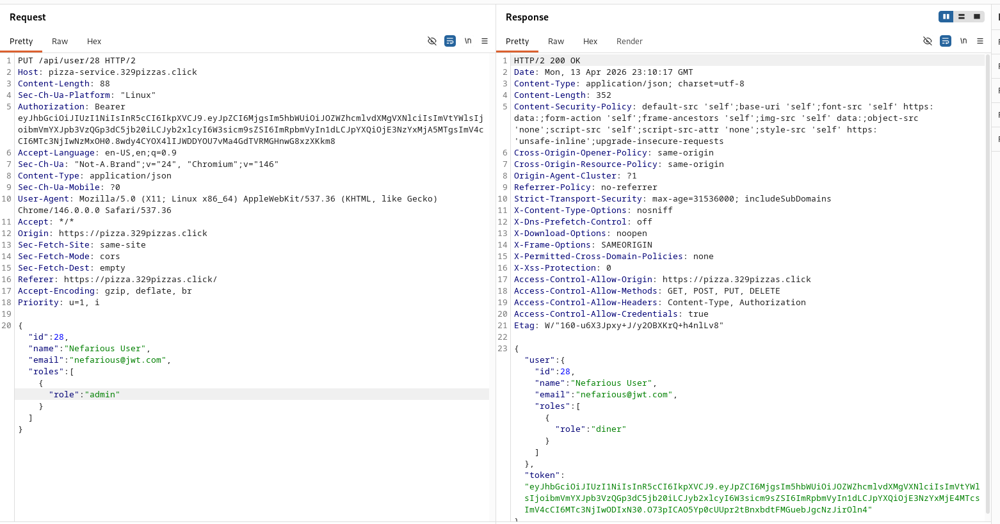

# Penetration Testing

## Jordan Hiatt and Grant Gardner

### Self Attacks:

#### Jordan Hiatt

Attack 1:

| Item           | Result                                                             |
| -------------- | ------------------------------------------------------------------ |
| Date           | April 10, 2026                                                     |
| Target         | pizza-service.jordanhiatt.org                                      |
| Classification | Broken Object Level Authorization (BOLA)                           |
| Severity       | 0                                                                  |
| Description    | Attempted to use my auth token to access someone elses information |
| Images         |                                                    |
| Corrections    | None, user was not authorized                                      |

Attack 2:

| Item           | Result                                                                                                                                    |
| -------------- | ----------------------------------------------------------------------------------------------------------------------------------------- |
| Date           | April 10, 2026                                                                                                                            |
| Target         | pizza-service.jordanhiatt.org                                                                                                             |
| Classification | Injection                                                                                                                                 |
| Severity       | 0                                                                                                                                         |
| Description    | Attempted to gain login access by using a sql command                                                                                     |
| Images         |    |
| Corrections    | None, user was unable to bypass login credentials                                                                                         |

Attack 3:

| Item           | Result                                        |
| -------------- | --------------------------------------------- |
| Date           | April 10, 2026                                |
| Target         | pizza-service.jordanhiatt.org                 |
| Classification | Injection                                     |
| Severity       | 0                                             |
| Description    | Attempted to drop a table using sql injection |
| Images         |   |
| Corrections    | None, user was unable to drop any tables      |

Attack 4:

| Item           | Result                                                                                                                                    |
| -------------- | ----------------------------------------------------------------------------------------------------------------------------------------- |
| Date           | April 10, 2026                                                                                                                            |
| Target         | pizza.jordanhiatt.org                                                                                                                     |
| Classification | Security Misconfiguration                                                                                                                 |
| Severity       | 0                                                                                                                                         |
| Description    | Looked for a .env file and through the robots.txt to see if any valuable secrets were published to the website.                           |
| Images         |    |
| Corrections    | None, no secrets were exposed in either of these 2 documents.                                                                             |

Attack 5:

| Item           | Result                                                     |
| -------------- | ---------------------------------------------------------- |
| Date           | April 10, 2026                                             |
| Target         | pizza.jordanhiatt.org                                      |
| Classification | Security Misconfiguration                                  |
| Severity       | 1                                                          |
| Description    | Stack trace was sent back when an error was found          |
| Corrections    | Remove the stack trace default send in the service.js file |

### Peer Attack:

Attack 1:

| Item           | Result                                                             |
| -------------- | ------------------------------------------------------------------ |
| Date           | April 13, 2026                                                     |
| Target         | https://pizza-service.329pizzas.click/                             |
| Classification | Broken Object Level Authorization (BOLA)                           |
| Severity       | 0                                                                  |
| Description    | Attempted to use my auth token to access someone elses information |
| Images         |                                                |
| Corrections    | None, user was not authorized                                      |

Attack 2:

| Item           | Result                                                            |
| -------------- | ----------------------------------------------------------------- |
| Date           | April 13, 2026                                                    |
| Target         | https://pizza-service.329pizzas.click/                            |
| Classification | Injection                                                         |
| Severity       | 0                                                                 |
| Description    | Attempted to gain login access by using a sql command             |
| Images         |    |
| Corrections    | None, user was not authorized                                     |

Attack 3:

| Item           | Result                                                                    |
| -------------- | ------------------------------------------------------------------------- |
| Date           | April 13, 2026                                                            |
| Target         | https://pizza-service.329pizzas.click/                                    |
| Classification | Brute Force Attack                                                        |
| Severity       | 0                                                                         |
| Description    | Attempted to brute force into application                                 |
| Corrections    | None, login was rate limited to 20 requests and made it super inefficient |

Attack 4:

| Item           | Result                                                              |
| -------------- | ------------------------------------------------------------------- |
| Date           | April 13, 2026                                                      |
| Target         | https://pizza-service.329pizzas.click/                              |
| Classification | Security Misconfiguration                                           |
| Severity       | 0                                                                   |
| Description    | Attempted to find secrets and vulnerabilites in robots.txt and .env |
| Images         |      |
| Corrections    | None, secrets were left out or discovered in these common files     |

Attack 5:

| Item           | Result                                                                      |
| -------------- | --------------------------------------------------------------------------- |
| Date           | April 13, 2026                                                              |
| Target         | https://pizza-service.329pizzas.click/                                      |
| Classification | Broken Access Control                                                       |
| Severity       | 0                                                                           |
| Description    | Attempted to change my role from diner to admin by changing the header body |
| Images         |                                                         |
| Corrections    | None, user role returned as diner. No elevation changed                     |
